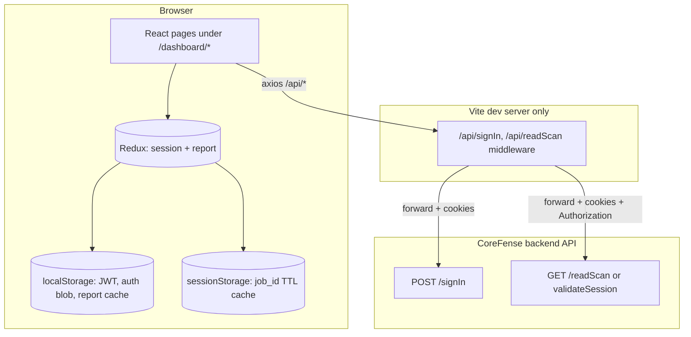

# CoreFense Dashboard: Frontend Architecture & Operations Guide

This document describes the **CoreFense** security dashboard frontend: what it does, how it is built, how data flows from the backend into the UI, and how operators and engineers work with it day to day.

The codebase lives in this repository under the npm package name **`corefense-dashboard`**. It is a **React 18** single-page application (SPA) bootstrapped with **Vite 5**, styled primarily with **Bootstrap 5** and **Sass**, and structured around a **Redux Toolkit** store for session and scan-report state.

**Living documentation.** This file is intended to stay accurate as the product evolves: architecture sections for engineers, operational sections for platform teams, and narrative sections for **external reviews** (customer pilots, partner technical due diligence, executive readouts). When behavior changes in code, update the matching section here in the same change set when practical.

---

## Table of contents

1. [Audience and how to use this document](#1-audience-and-how-to-use-this-document)
2. [Product overview (client-facing)](#2-product-overview-client-facing)
3. [Technical stack](#3-technical-stack)
4. [High-level architecture](#4-high-level-architecture)
5. [Repository layout](#5-repository-layout)
6. [Runtime composition](#6-runtime-composition)
7. [Routing and navigation](#7-routing-and-navigation)
8. [Authentication and session](#8-authentication-and-session)
9. [Backend integration](#9-backend-integration)
10. [Report data model in the UI](#10-report-data-model-in-the-ui)
11. [Environment configuration](#11-environment-configuration)
12. [Local development](#12-local-development)
13. [Production builds and deployment considerations](#13-production-builds-and-deployment-considerations)
14. [Security and privacy notes](#14-security-and-privacy-notes)
15. [Operational troubleshooting](#15-operational-troubleshooting)
16. [Extending the application (developer guide)](#16-extending-the-application-developer-guide)
17. [Legacy template surface area](#17-legacy-template-surface-area)
18. [Glossary](#18-glossary)
19. [Related systems](#19-related-systems)
20. [Executive summary and value proposition](#20-executive-summary-and-value-proposition)
21. [Capability matrix: available today vs on the roadmap](#21-capability-matrix-available-today-vs-on-the-roadmap)
22. [Guided live evaluation (technical review walkthrough)](#22-guided-live-evaluation-technical-review-walkthrough)
23. [Deployment models and enterprise integration](#23-deployment-models-and-enterprise-integration)
24. [Frequently asked questions (evaluators and buyers)](#24-frequently-asked-questions-evaluators-and-buyers)
25. [Briefing and demo readiness checklist](#25-briefing-and-demo-readiness-checklist)

---

## 1. Audience and how to use this document

| Audience | Suggested sections |
|----------|-------------------|
| **Client / stakeholder** | [§2](#2-product-overview-client-facing), [§20](#20-executive-summary-and-value-proposition), [§21](#21-capability-matrix-available-today-vs-on-the-roadmap), [§24](#24-frequently-asked-questions-evaluators-and-buyers), [§14](#14-security-and-privacy-notes), [§19](#19-related-systems) |
| **New frontend engineer** | [§3](#3-technical-stack) to [§10](#10-report-data-model-in-the-ui), [§16](#16-extending-the-application-developer-guide) |
| **DevOps / platform** | [§9](#9-backend-integration), [§11](#11-environment-configuration), [§13](#13-production-builds-and-deployment-considerations), [§15](#15-operational-troubleshooting), [§23](#23-deployment-models-and-enterprise-integration) |
| **QA** | [§7](#7-routing-and-navigation), [§8](#8-authentication-and-session), [§9](#9-backend-integration), [§15](#15-operational-troubleshooting), [§22](#22-guided-live-evaluation-technical-review-walkthrough) |
| **Partner / customer engineer (pilot)** | [§20](#20-executive-summary-and-value-proposition), [§22](#22-guided-live-evaluation-technical-review-walkthrough), [§23](#23-deployment-models-and-enterprise-integration), [§25](#25-briefing-and-demo-readiness-checklist) |
| **Procurement / risk** | [§14](#14-security-and-privacy-notes), [§24](#24-frequently-asked-questions-evaluators-and-buyers), [§23](#23-deployment-models-and-enterprise-integration) |

---

## 2. Product overview (client-facing)

### 2.1 Purpose

The CoreFense dashboard presents **security posture** derived from **host scan reports** ingested by the CoreFense backend. Operators sign in, then explore visualizations and drill-downs across several domains, including (where enabled in the product):

- **Dashboard (home)**: consolidated security overview, radar-style posture view, and insight cards driven by the latest scan payload and optional **report diffs** (baseline vs target).
- **Filesystems**: filesystem-related findings from the scan.
- **Kernel** (kernel configurations): kernel hardening and configuration signals.
- **Binary** (binary hardening): binary exposure and hardening analysis, including diff-oriented panels where applicable.
- **Vulnerabilities**: CVE-oriented views (route exists; sidebar may emphasize other areas first).

The sidebar also lists **“In Progress”** items (e.g. Sandboxing, EU CRA, SBOM) as **disabled placeholders** for roadmap visibility.

### 2.2 How operators typically use it

1. Open the web app URL provided by your environment team.
2. **Sign in** with credentials issued for your tenant (client id / password, or email-style identifier where supported).
3. Optionally open a **direct link** that includes a **`job_id`** query parameter to pin the UI to a specific scan job; otherwise the app may resolve **latest** or a **cached job** within the same browser tab (see [§8.3](#83-job-id-and-dashboardbootstrap)).
4. Navigate between **Dashboard**, **Filesystems**, **Kernel**, and **Binary** using the left navigation.

### 2.3 What this frontend does *not* do

- It does **not** run scans; scanning and persistence are backend responsibilities.
- It does **not** verify JWT signatures in the browser (it reads claims such as `client_id` and `exp` for UX only; trust boundaries remain on the server).
- In **development**, API traffic to the real backend is mediated by a **Vite development proxy**; the built static assets in production expect equivalent **`/api/*`** routing unless you change the client (see [§9.3](#93-development-vs-production-api-paths)).

---

## 3. Technical stack

| Layer | Choice | Notes |
|-------|--------|------|
| UI library | React 18 | Vite config **dedupes** `react` / `react-dom` to avoid invalid hook / duplicate React issues. |
| Build tool | Vite 5 | Dev server, HMR, `import.meta.env`, plugins. |
| Language | JavaScript (JSX) | Some TypeScript tooling in devDependencies for editor/lint alignment; app source is predominantly `.jsx`. |
| State | Redux Toolkit | Two slices: `session`, `report`. Async flows use `createAsyncThunk`. |
| HTTP | Axios | Global interceptors in `src/lib/jwt.js` for JWT on `/api` and 401 handling. |
| Routing | React Router 7 | `BrowserRouter` in `main.jsx`, route table in `src/routes/`. |
| Styling | Bootstrap 5 + Sass | Global entry `src/assets/scss/app.scss`. |
| Charts / maps | ApexCharts, Recharts, react-google-maps, etc. | Used across dashboard and template demo pages. |
| Forms / UX | react-hook-form, yup, react-toastify, sweetalert2, etc. | Shared with template-derived pages. |

---

## 4. High-level architecture

The browser loads a static shell (`index.html`) that mounts React at `#root`. Providers wrap the tree; the router chooses **auth layout** vs **admin layout** based on authentication. Authenticated users see the **AdminLayout** (top bar + sidebar + content). **DashboardBootstrap** runs headlessly on every navigation to align Redux **session** with URL/cached **job_id** and to trigger **report** fetches.



**Key idea:** the UI treats **`/api/*`** as its public HTTP surface. In local development, Vite implements that surface and forwards to the configured backend origin. In production, you normally terminate TLS at a gateway and **reverse proxy** the same paths to the API (or serve the SPA and proxy `/api` on the same host).

---

## 5. Repository layout

High-signal directories under the project root:

| Path | Role |
|------|------|
| `src/main.jsx` | App entry: `setupAxiosAuth()`, `BrowserRouter`, `App`. |
| `src/App.jsx` | Providers wrapper + router + scroll restoration + global SCSS. |
| `src/components/wrappers/AppProvidersWrapper.jsx` | Redux `Provider`, auth/layout/notification contexts, `DashboardBootstrap`, toasts. |
| `src/components/bootstrap/DashboardBootstrap.jsx` | URL / cache-driven session sync + `fetchReportForSession` dispatch. |
| `src/routes/router.jsx` | Auth vs admin routes; redirect to `/dashboard/signIn` when unauthenticated. |
| `src/routes/index.jsx` | Large route table: CoreFense dashboard routes + many **template** routes (UI kit, charts, etc.). |
| `src/app/(admin)/dashboard/*` | **Product** pages: analytics, filesystems, kernel-configs, binary-hardening, vulnerabilities. |
| `src/store/` | Redux store and slices (`sessionSlice`, `reportSlice`). |
| `src/lib/jwt.js` | JWT storage + axios interceptors + tab visibility expiry check. |
| `src/lib/jobIdCache.js` | TTL-based `job_id` cache in `sessionStorage`. |
| `src/context/` | Auth, layout, notifications, constants. |
| `src/layouts/` | `AdminLayout`, `AuthLayout`. |
| `src/assets/scss/` | Global and structural styles. |
| `src/assets/data/menu-items.js` | Sidebar menu definition for CoreFense. |
| `vite-plugins/report-fetch.js` | **Dev-only** proxy for sign-in and read-scan; optional snapshot write to `src/report.json`. |
| `vite.config.js` | Path alias `@` resolves to the `src` folder; React dedupe; `reportFetchPlugin`. |

> **Note on `src/report.json`:** the Vite plugin may write a **developer snapshot** of the last fetched report for inspection. The **UI does not import this file**; Redux remains the source of truth (`reportSlice` comments document this).

---

## 6. Runtime composition

### 6.1 Provider stack (`AppProvidersWrapper`)

Order matters for context dependencies:

1. **`Provider` (Redux)**: global store.
2. **`AuthProvider`**: `user`, `isAuthenticated`, `saveSession`, `removeSession`.
3. **`LayoutProvider`**: theme / layout preferences (including persisted theme via `localStorage` keys used in `index.html` splash logic).
4. **`NotificationProvider`**: in-app notification plumbing.
5. **`DashboardBootstrap`**: synchronizes session from the URL and triggers report loading (see [§8.3](#83-job-id-and-dashboardbootstrap)).
6. **`ToastContainer`**: global toast host.

### 6.2 Layouts

- **`AuthLayout`**: centered auth experiences (sign-in, etc.).
- **`AdminLayout`**: lazy-loaded top navigation, vertical navigation, fluid content area, footer. Page bodies are lazy-loaded with `Suspense` + preloaders.

---

## 7. Routing and navigation

### 7.1 Router behavior (`src/routes/router.jsx`)

- **`authRoutes`** (sign-in, error pages, maintenance, etc.) render inside **`AuthLayout`** and are **not** wrapped by the authenticated admin shell.
- **`appRoutes`** render inside **`AdminLayout`** **only if** `isAuthenticated` is true; otherwise the user is **`Navigate`d** to **`/dashboard/signIn`** with:
  - `redirectTo`: original path + query for post-login return.
  - `job_id`: preserved from `job_id` or `jobId` query params when present.

This design keeps **`/dashboard/signIn`** outside the guarded app route list (see comment in `src/routes/index.jsx`) to avoid redirect loops.

### 7.2 Core product routes (subset)

| Path | Page module | User-facing label (approx.) |
|------|-------------|-------------------------------|
| `/` | Redirect | Sends the user to `/dashboard` |
| `/dashboard` | `dashboard/analytics/page` | Dashboard (home / analytics) |
| `/dashboard/filesystems` | `dashboard/filesystems/page` | Filesystems |
| `/dashboard/kernel-configs` | `dashboard/kernel-configs/page` | Kernel |
| `/dashboard/binary-hardening` | `dashboard/binary-hardening/page` | Binary |
| `/dashboard/vulnerabilities` | `dashboard/vulnerabilities/page` | Vulnerabilities |

### 7.3 Sidebar

`src/assets/data/menu-items.js` defines the **active** operator menu (CoreFense sections + disabled roadmap entries). Many historical template entries are commented out but kept for reference.

---

## 8. Authentication and session

### 8.1 Auth state (`AuthProvider`)

- Primary persistence: **`localStorage`** key **`__COREFENSE_AUTH__`** (avoids oversized `Cookie` headers that can trigger HTTP 431 in dev).
- Legacy fallback: cookie **`_Rasket_AUTH_KEY_`** parsed as JSON if present.
- **`removeSession`** clears JWT, job ID cache, legacy cookies, auth/session/report caches, and navigates to **`/dashboard/signIn`**.

### 8.2 JWT handling (`src/lib/jwt.js`)

- On startup, **`setupAxiosAuth()`** registers:
  - **Request interceptor:** for URLs starting with **`/api`**, attach `Authorization: Bearer <token>` if stored.
  - **Response interceptor:** on **401** from `/api` (except sign-in), clear storage and redirect to sign-in with `redirectTo`.
  - **`visibilitychange`:** if JWT `exp` is in the past, clear and redirect (avoids stale UI after laptop sleep, etc.).
- Token storage key: **`__COREFENSE_JWT__`** (stores raw token without `Bearer ` prefix).

### 8.3 Job id and `DashboardBootstrap`

`DashboardBootstrap` coordinates **URL query params**, **sessionStorage TTL cache** (`jobIdCache.js`), and Redux **`sessionSlice`**:

1. If **`job_id` / `jobId` / `jobid`** appears in the URL, use it, save it to cache, and update the Redux session.
2. Otherwise use a **valid cached** `job_id` (1 hour default TTL) for the same tab.
3. Otherwise treat the target as **latest** (`null` job id for fetch semantics).

When authenticated, a second effect dispatches **`fetchReportForSession`** when the effective job id changes or report state requires a refetch.

### 8.4 Sign-in flow (Redux)

`signInAndLoadReport` in `reportSlice.js`:

- **POST** relative URL **`/api/signIn`** with JSON body:
  - `{ client_id, password }` if identifier has no `@`
  - `{ email, password }` if identifier contains `@`
- **`withCredentials: true`** so Set-Cookie flows work through the proxy when used.
- On success, extracts optional **`Authorization`** header, derives **`client_id`** from JWT payload (for profile UI), normalizes **`report`** from payload, applies an in-browser **CVE demo transform** (see below), caches report under **“latest”**, returns data for the UI to call `saveSession` / `setToken`.

**Important:** sign-in is intentionally **not** sent with `job_id` in the body; job-specific views are loaded via **`fetchReportForSession`** after authentication.

---

## 9. Backend integration

### 9.1 Dev proxy plugin (`vite-plugins/report-fetch.js`)

When you run **`npm run dev`**, Vite registers middleware:

| Browser path | Proxied to backend | Methods |
|--------------|---------------------|---------|
| `/api/signIn` or `/api/signin` | `{COREFENSE_BACKEND_ORIGIN}/signIn` | POST |
| `/api/readScan` or `/api/readscan` | `{COREFENSE_BACKEND_ORIGIN}/{COREFENSE_READSCAN_PATH}` default **`readScan`** | GET |

Behavior:

- Forwards **Content-Type**, **Cookie**, and on responses forwards **`Set-Cookie`** and **`Authorization`** when present.
- Supports **`job_id`** as a query parameter on both proxy endpoints.
- On success, writes a pretty-printed JSON snapshot to **`src/report.json`** (developer convenience only).

Backend origin resolution:

- **`process.env.COREFENSE_BACKEND_ORIGIN`** from `.env` / shell environment when Vite starts.
- If unset, a **hard-coded default** may apply (see plugin source on your branch); always set **`COREFENSE_BACKEND_ORIGIN`** explicitly for predictable behavior.

### 9.2 Frontend axios calls

`reportSlice` uses:

- **`POST /api/signIn`**: authentication + initial report payload.
- **`GET /api/readScan?job_id=...`**: session-authenticated report load; omit `job_id` for latest.

Timeout: **`VITE_API_TIMEOUT_MS`** (default **60000** ms in slice).

### 9.3 Development vs production API paths

| Mode | `/api/*` implementation |
|------|-------------------------|
| **Vite dev** (`npm run dev`) | Provided by **`report-fetch`** plugin. |
| **`vite preview` / static CDN** | **No plugin** unless you add a server; you must supply **reverse proxy** routes matching `/api/signIn` and `/api/readScan` (or change the client base URL strategy). |

Plan production so the **browser origin** that serves the SPA can call **`/api/...`** on the **same origin** (recommended) or a CORS-approved API host with consistent credentials policy.

### 9.4 CORS and cookies

The dev proxy exists partly to **avoid CORS pain** during local work: the browser talks to the Vite origin; Node forwards to the API. Production gateways should mirror that contract if the SPA continues to use relative `/api` paths.

---

## 10. Report data model in the UI

### 10.1 Redux `report` slice

State fields (conceptual):

- **`data`**: normalized report object used by pages (`selectReport`).
- **`reportDiffs`**: optional structure for baseline vs target comparisons when the API supplies it.
- **`reportTimestamp`**: scan time / API timestamp for display.
- **`status`**: `idle` | `loading` | `succeeded` | `failed`.
- **`error`**: user-facing message where available.
- **`lastFetchedJobId`**: tracks which job id the current report belongs to after `fetchReportForSession`.

### 10.2 Browser CVE flip transform

`reportSlice` applies **`flipSomePatchedToUnpatched`**: a deterministic, seeded perturbation that flips a small fraction of **`Patched`** CVE issues to **`Unpatched`** for demo / UX purposes. Same `job_id` yields the same pattern. **Stakeholders should treat CVE status in dev demos accordingly**; production relevance depends on product decision.

### 10.3 Local report cache

If **`fetchReportForSession`** fails but a cached report exists in **`localStorage`** (`__COREFENSE_REPORT_CACHE__`), the slice can fall back to cached data to avoid blank dashboards during transient network errors.

---

## 11. Environment configuration

Copy **`.env.example`** to **`.env.local`** (or use shell exports) before `npm run dev`.

| Variable | Where read | Purpose |
|----------|------------|---------|
| **`COREFENSE_BACKEND_ORIGIN`** | `vite-plugins/report-fetch.js` (Node) | Backend base URL for proxy (e.g. `http://localhost:8082`). |
| **`COREFENSE_READSCAN_PATH`** | Same | Path segment on backend for read-scan; default **`readScan`**. Set to e.g. **`validateSession`** if your API uses that route name instead. |
| **`VITE_API_TIMEOUT_MS`** | `reportSlice.js` (browser) | Axios timeout for `/api` calls. |

Vite exposes only variables prefixed with **`VITE_`** to client code by design; backend origin is **not** exposed to the browser because it is read in the **Node** plugin.

---

## 12. Local development

### 12.1 Prerequisites

- **Node.js** compatible with Vite 5 / React 18 (LTS recommended).
- **npm** (or adapt commands for pnpm/yarn if your team standardizes differently).
- A running **CoreFense backend** reachable from the machine running Vite (often `http://localhost:8082` when using the backend team’s Docker scripts).

### 12.2 Install and run

```bash
cd /path/to/demo-dashboard   # repository root for this frontend
npm install
cp .env.example .env.local    # then edit COREFENSE_BACKEND_ORIGIN
npm run dev
```

**Scripts** (`package.json`):

| Script | Behavior |
|--------|----------|
| **`npm run dev`** | Vite on **`0.0.0.0:8000`** with larger max HTTP header size (mitigates large cookie / header issues). |
| **`npm run dev:fresh`** | Clears Vite prebundle cache then `dev`. |
| **`npm run build`** | Production bundle to `dist/`. |
| **`npm run preview`** | Serves `dist/` (remember [§9.3](#93-development-vs-production-api-paths)). |
| **`npm run lint`** | ESLint, zero warnings policy. |
| **`npm run format`** | Prettier on `src/**/*.{js,jsx}`. |

> **Port note:** `vite.config.js` sets `server.port` **5174** with `strictPort: false`; the **`dev`** script overrides host/port to **`0.0.0.0:8000`**. Use whichever port your terminal prints.

### 12.3 Typical dev loop with backend

1. Start backend API (per backend repo documentation).
2. Seed or upload scan fixtures if you need specific **`job_id`** values.
3. Start this frontend with **`COREFENSE_BACKEND_ORIGIN`** pointing at that API.
4. Open the printed dev URL, sign in, append **`?job_id=...`** when testing deep links.

---

## 13. Production builds and deployment considerations

### 13.1 `npm run build`

Outputs static assets under **`dist/`** with **source maps** enabled in `vite.config.js` (adjust if your release process forbids public source maps).

### 13.2 React vendor chunking

Rollup `manualChunks` may emit a **`react-vendor`** chunk to keep React isolated and cache-friendly.

### 13.3 Base path

`vite.config.js` sets `base: "/"`. If the SPA is hosted under a subpath, align **`base`**, **`BrowserRouter` `basename`** (see `basePath` in `src/context/constants.js`), and gateway routing.

### 13.4 Headers and TLS

- Terminate **HTTPS** at the edge.
- If using cookies across subdomains, configure **`Secure`**, **`SameSite`**, and **`Domain`** consistently with backend auth.
- Large headers: the dev script raises Node header limits; production front proxies may need analogous tuning if cookies grow large (prefer slim tokens / server-side sessions long term).

---

## 14. Security and privacy notes

- **Secrets:** OpenAI or other third-party keys belong **only** on backend services, never in this frontend bundle.
- **JWT in `localStorage`** is vulnerable to XSS. Mitigations are standard: strict CSP, dependency hygiene, sanitization for any HTML sinks, minimal third-party scripts. Evaluate **httpOnly cookie** sessions if threat model requires it.
- **Client-side JWT “expiry” checks** decode Base64 without signature verification; they are UX guards, not security boundaries.
- **Do not commit** `.env.local`, JWTs, or customer scan JSON to git.

---

## 15. Operational troubleshooting

| Symptom | Likely cause | What to check |
|---------|--------------|---------------|
| Stuck on splash / blank | JS error before mount | Browser devtools console, network tab for failed chunk loads. |
| **431 Request Header Fields Too Large** | Oversized cookies | Auth moved toward `localStorage`; clear old cookies for the dev site. Dev server increases header limit in `npm run dev`. |
| **`Invalid hook call` / duplicate React** | Two React copies | Vite aliases + dedupe; reinstall `node_modules`; avoid linking a second React. |
| Sign-in succeeds but report empty | Payload shape | Network tab: `/api/signIn` JSON; confirm `report` vs root object matches slice expectations. |
| `/api/readScan` 401 loop | Expired JWT / bad session | Clear `__COREFENSE_JWT__`, sign in again; verify backend clock skew. |
| Proxy cannot reach backend | Wrong `COREFENSE_BACKEND_ORIGIN` | Must be reachable **from the Vite process** (not only from the browser). |
| Wrong read endpoint | Backend route name | Set **`COREFENSE_READSCAN_PATH`** to match (`readScan` vs `validateSession`). |
| **`>` continuation in shell** after `export` | Smart quotes | Use straight ASCII `'` or `"` in terminal exports. |

---

## 16. Extending the application (developer guide)

### 16.1 Add a new dashboard page

1. Create `src/app/(admin)/dashboard/<feature>/page.jsx` (follow existing folder conventions).
2. Register a lazy import + route object in **`src/routes/index.jsx`** inside `generalRoutes` (or a dedicated array you merge).
3. Add a **`MENU_ITEMS`** entry in **`src/assets/data/menu-items.js`** with `url` matching the route `path`.
4. Read data via **`useSelector(selectReport)`** or more specific selectors/hooks as the feature matures.

### 16.2 Add a new API call

- Prefer extending **`reportSlice`** thunks or adding RTK Query only if the team adopts it project-wide.
- Keep URLs on the **`/api`** prefix so **dev proxy** and **axios JWT interceptors** stay consistent.
- Document any new env vars in **`.env.example`** and in this file.

### 16.3 Styling

- Prefer existing Bootstrap utility patterns used in sibling pages.
- Global structural tweaks: `src/assets/scss/structure/`.
- Dark mode follows Bootstrap **`data-bs-theme`** patterns (see `index.html` inline script + layout context).

### 16.4 Quality gates

Run **`npm run lint`** before PRs. Keep **Prettier** formatting for touched files (`npm run format`).

---

## 17. Legacy template surface area

This project started from a large admin **template** (branding remnants: “Rasket”, Techzaa links in `constants`, extensive routes under `/ui`, `/charts`, `/apps`, etc.). Many routes remain **available** but are **not** part of the CoreFense operator menu.

**Guidance:**

- For product work, stay within **`src/app/(admin)/dashboard/`** and shared layout/components.
- Avoid removing massive template sections in passing PRs unless the team explicitly approves shrinkage (merge noise vs value).

---

## 18. Glossary

| Term | Meaning |
|------|---------|
| **job_id** | Identifier for a specific scan job on the backend; optional query param on read-scan. |
| **readScan** | Backend endpoint family returning report JSON for the authenticated session. |
| **report_diffs** | Optional payload section comparing a baseline build to the current target. |
| **Redux slice** | A partitioned reducer + actions + selectors in Redux Toolkit. |
| **Vite plugin `report-fetch`** | Dev middleware implementing `/api/signIn` and `/api/readScan`. |

---

## 19. Related systems

- **Backend API** (`backend-api` repository in the same workspace): provides **`/signIn`**, **`/readScan`** (or **`/validateSession`** depending on deployment), persists scans, and may call LLM services with keys that **never** ship to this frontend.
- **E2E / fixtures:** backend tests may upload **`report3.json` / `report4.json`** style fixtures; coordinate with backend docs for consistent **`job_id`** during demos.

---

## 20. Executive summary and value proposition

### 20.1 Problem space

Organizations hardening Linux hosts need a **single place** to interpret scan output: posture across **filesystem**, **kernel**, **binary**, and **vulnerability** dimensions, with enough context to prioritize remediation and to understand **change over time** when the backend supplies comparison metadata (`report_diffs`).

### 20.2 What the dashboard delivers

- **Operator clarity:** After authentication, the UI presents scan-backed views without requiring operators to raw-read JSON reports.
- **Unified navigation:** A consistent shell (header, sidebar, theme) anchors all security modules.
- **Deep-linking:** Optional **`job_id`** in the URL pins the session to a specific stored scan for audits, ticket handoffs, or reproducible reviews.
- **Baseline vs target narrative:** Where the API includes diff payloads, the home dashboard can communicate improvement or regression at a glance (see analytics components and `report_diffs` usage in code).

### 20.3 Architectural selling points (technical)

- **Thin client:** The browser renders state; **authoritative scan logic and LLM usage remain server-side** (see backend documentation).
- **Predictable API surface:** The SPA talks to **`/api/signIn`** and **`/api/readScan`** (or the configured read path), which maps cleanly to gateway routing in customer environments.
- **Modern maintainability:** React 18 + Vite + Redux Toolkit is a common hiring and contracting profile, lowering long-term cost of ownership.

### 20.4 Honest boundaries

- **CVE demo transform:** As documented in [§10.2](#102-browser-cve-flip-transform), an in-browser transform may alter a subset of patched CVE rows for demonstration consistency. **Pilot environments should confirm whether this transform is disabled or irrelevant in production builds** before treating CVE rows as audit evidence.
- **Template carryover:** Non-product routes from the original admin template may still exist; operator value is concentrated under **`/dashboard/*`** ([§17](#17-legacy-template-surface-area)).

---

## 21. Capability matrix: available today vs on the roadmap

Use this table when answering “what is real today?” in customer or partner sessions. Labels follow the sidebar in `menu-items.js` and registered routes.

| Capability | Operator navigation | Typical content source | Notes |
|------------|---------------------|-------------------------|--------|
| Security overview / analytics | **Dashboard** (`/dashboard`) | `report` + optional `report_diffs` | Primary landing; radar and insight cards. |
| Filesystem posture | **Filesystems** | `report` | Drill-downs depend on payload shape from backend. |
| Kernel posture | **Kernel** | `report` | Kernel configs / hardening signals. |
| Binary posture | **Binary** | `report` + diffs where wired | May include diff panels for binary-related changes. |
| Vulnerabilities | **Vulnerabilities** (route) | `report` | Exposed in routing; sidebar emphasis may vary by branch. |
| Sandboxing | Sidebar (disabled) | n/a | **Roadmap / placeholder** (not an active product module in the menu today). |
| EU Cyber Resilience Act | Sidebar (disabled) | n/a | **Roadmap / placeholder**. |
| SBOM | Sidebar (disabled) | n/a | **Roadmap / placeholder**. |

**Roadmap disclaimer:** Disabled menu entries communicate direction only; they are **not** commitments with dates unless your commercial or product team documents them separately.

---

## 22. Guided live evaluation (technical review walkthrough)

This section supports **repeatable** technical walkthroughs (customer pilots, partner onboarding sessions, or internal dry runs) without improvising flow.

### 22.1 Preconditions (owner checklist)

| Item | Why it matters |
|------|----------------|
| Backend reachable from reviewers’ networks (or VPN) | SPA only renders what the API returns. |
| TLS and DNS match your production-like environment | Avoids mixed-content and cookie surprises. |
| Valid **tenant credentials** (or SSO, if integrated on your branch) | Unblocks sign-in. |
| At least one **scan job** ingested; optional **`job_id`** for a fixed narrative | Lets you deep-link to a known-good story. |
| Screen share resolution ≥ 1280px width | Layout uses responsive breakpoints; ultra-narrow mobile is not the primary operator target. |

### 22.2 Suggested flow (about 8 to 12 minutes)

1. **Landing and branding**: Show the splash screen, then the dashboard shell; mention **CoreFense** title and light/dark theme if relevant to the account.
2. **Authentication**: Sign in; state that credentials are **tenant-scoped** and issued by the deploying organization (not “open demo” unless you explicitly run one).
3. **Home dashboard**: Walk the **posture overview**: radar / composite score if visible, **insight cards**, and any **baseline vs target** copy supported by `report_diffs` (quote build ids / timestamps shown in UI when present).
4. **Filesystems**: Tie UI widgets to concrete findings (directories, mounts, or policy checks; this depends on report schema).
5. **Kernel**: Emphasize **hardening configuration** signals relevant to the audience (e.g. server fleet vs workstation).
6. **Binary**: Highlight **exposure** and **hardening** deltas if diffs are loaded; otherwise show static posture.
7. **Deep link** (optional 60 seconds): Append **`?job_id=<id>`** to the URL, refresh, and show that the UI **pins** to that job ([§8.3](#83-job-id-and-dashboardbootstrap)).
8. **Roadmap**: Scroll sidebar **In Progress** entries and clarify they are **disabled placeholders** ([§21](#21-capability-matrix-available-today-vs-on-the-roadmap)).
9. **Q&A handoff**: Point technical audiences to [§4](#4-high-level-architecture), [§9](#9-backend-integration), and [§14](#14-security-and-privacy-notes).

### 22.3 Questions reviewers often ask (see also [§24](#24-frequently-asked-questions-evaluators-and-buyers))

- Where is data stored? (Browser vs server: [§14](#14-security-and-privacy-notes), [§10.3](#103-local-report-cache).)
- Can this run entirely on-premises? ([§23](#23-deployment-models-and-enterprise-integration).)
- How do we know the UI matches the backend contract? (Point to `reportSlice`, proxy plugin, and backend OpenAPI or internal API docs if published.)

---

## 23. Deployment models and enterprise integration

### 23.1 Common patterns

| Pattern | Description | Frontend implication |
|---------|-------------|------------------------|
| **Same-origin SPA + API proxy** | CDN or object storage serves `dist/`; gateway paths **`/api/*`** to the CoreFense API. | Matches the relative `/api` design ([§9.3](#93-development-vs-production-api-paths)). |
| **Dedicated API host** | SPA on `app.customer.com`, API on `api.customer.com`. | Requires **CORS**, **credentials**, and consistent cookie `Domain` / `SameSite` policies agreed with backend. |
| **Private VPC / air-gapped** | No public internet; images and bundles promoted internally. | Same as above; ensure build pipelines do not phone home to third-party CDNs if policy forbids it (audit `index.html` font links and any runtime telemetry if added later). |

### 23.2 Identity and access

The stock UI implements **credential sign-in** against **`/api/signIn`** and bearer **JWT** for subsequent reads. Enterprise deployments may layer **SSO**, **mTLS**, or **API gateways** in front of the same routes. Those concerns are split between **gateway configuration** and **backend auth implementation**; document any customer-specific variant in an addendum rather than in this generic file.

### 23.3 Observability (operator experience)

From the browser’s perspective, failures surface as HTTP **4xx/5xx**, toast messages, or empty states. For production support, correlate **gateway access logs** (path, status, latency) with **backend traces**. The frontend does not mandate a specific analytics vendor; if product adds client telemetry later, document privacy impact here.

---

## 24. Frequently asked questions (evaluators and buyers)

**Does the dashboard run scans?**  
No. Scan execution, storage, and policy engines are backend responsibilities ([§2.3](#23-what-this-frontend-does-not-do)).

**Where does scan data live?**  
Authoritative data lives in the **backend / database** you deploy. The browser holds **in-memory Redux state** and may persist **JWT**, **auth blob**, **job id cache**, and **report cache** in web storage for resilience and UX ([§8](#8-authentication-and-session), [§10.3](#103-local-report-cache)). Classify those mechanisms in your DPIA / security questionnaire under “end-user device storage.”

**Is the open-source template a security liability?**  
The template increases **surface area** (extra routes). Production deployments should **strip or block** unused routes at the gateway or build pipeline if required by policy ([§17](#17-legacy-template-surface-area)).

**Browser support?**  
Modern evergreen browsers (last two major versions of Chrome, Edge, Firefox, Safari) are the practical target for React 18 + Vite builds. Formalize a matrix per release if customers require it.

**Accessibility?**  
Bootstrap and custom components vary in WCAG coverage. If a customer mandates **WCAG 2.1 AA**, schedule an audit pass on dashboard routes and remediate before contractual sign-off.

**Can API keys (OpenAI, etc.) appear in the bundle?**  
They must not. Only **`VITE_*`** variables are exposed to client code by Vite’s model; backend origins for dev proxy are **Node-side** ([§11](#11-environment-configuration)).

---

## 25. Briefing and demo readiness checklist

Use this before any **scheduled technical session** with external parties to reduce last-minute risk.

- [ ] **Build identity:** Note the **git SHA** or release tag of this repo and the backend repo shown to reviewers (append to slides or shared notes).
- [ ] **Environment banner:** If you use staging, label it clearly in speaking notes so findings are not mistaken for production customer data.
- [ ] **Credentials:** Distribute **read-only** pilot credentials; rotate after the session if shared broadly.
- [ ] **Data story:** Pick one **`job_id`** with compelling diffs if your backend populates `report_diffs`.
- [ ] **Network path:** Confirm reviewers can reach the **same origin** (or approved API host) without ad-hoc certificate overrides.
- [ ] **Fallback:** Pre-open a second browser profile in case cookies from a previous demo interfere ([§15](#15-operational-troubleshooting)).
- [ ] **CVE transform:** Confirm with engineering whether [§10.2](#102-browser-cve-flip-transform) affects your build; adjust spoken claims accordingly.
- [ ] **Optional captures:** For slide decks or leave-behind PDFs, capture **Dashboard**, **Filesystems**, **Kernel**, and **Binary** in both themes if your brand guidelines require it (replace this bullet with links to your internal asset library when available).

---

## Document control

| Field | Value |
|-------|-------|
| Scope | Frontend repository **`corefense-dashboard`** (folder `demo-dashboard` on disk) |
| Maintainer | Team owning CoreFense UI |
| Update trigger | When auth flow, proxy contract, route map, primary menu, **evaluation narrative**, or **deployment claims** change materially |

When this document and the code disagree, **the code on your branch is authoritative**; open a PR to realign this file.
